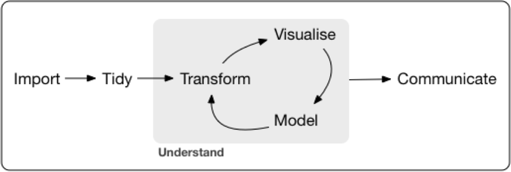

```{r setup, include=FALSE}
knitr::opts_chunk$set(echo = TRUE)
```

#Introduction

Every two years our nation goes thru the process of electing out government officials. It seems every year the bipartisan rhetoric gets stronger and strong. Many claims are made on what happens to the economy when either party is in control, of the President’s office, the Senate or the House. Coming right out of the mid-terms, looking at what next year brings economically is certainly of interest to all.

Gathering data from the Federal Reserve’s FRED service ( https://fred.stlouisfed.org ) and from scrapping results from elections from the web (such as https://transition.fec.gov/pubrec/electionresults.shtm), we can build a model of what next year has in store. 

We would start out by selecting economic indicators from the FRED site. Selecting interesting indicators will be done using  Wickham’s  workflow. Data will be imported, made tidy, possible transformations applied and then thru visualization the most “interesting” indicators will be selected.

 Electoral data will include the number of senate and house seats in congress the year after an election. Using this data together with our economic indicators, models will be built to predict a certain economic indicator. Several models can be used, presenting results from each in graphical form. We can also classify monthly economic data with a good, medium and poor economy tag. Once we do this we can train a classifier to tell us what the economic outlook might be given an input of congress seats.

There seems to be the notion that Python is a better language for machine learning and running classifiers. As a stretch got for this project, to experiment with something not covered in class, we can try running python code in RStudio using the reticulate library. If this is possible, training a classifier using the popular sci-kitlearn package in Python and comparing them with results in r, could give us a clue into which is better at machine learning.

#Workflow

We will use Hadley Wickman's Tidy Workflow as show below.



###Loading required libraries

```{r}
library("rvest")
library(tidyr)
require(mongolite)
library(dplyr)
library(ggplot2)

library(FredR)
library(pipeR)
library(kableExtra)
```

#Import Data

##Economic Indicators Dataset

The Federal Reserve's database has a selection of economic indicators. For this analysis we will look at GDP (Gross Domestic Product) indicators as a proxy for the health of the economy. To select an indicator we can first explore GDP indicators available.

```{r}
api.key = "4844eb6986119824760163e60bddd945"
fred<-FredR(api.key)

gdp.series <- fred$series.search("GDP")
gdp.series %>% kable() %>% kable_styling() %>% scroll_box(height = "400px")
```

From this selection we decide to use two indicators: Gross Domestic Product and Real Personal Consumption Expenditures.

```{r}
#Gross domestic product
gdp <- fred$series.observations(series_id = 'GDPC1')
head(gdp,n=100) %>% kable() %>% kable_styling() %>% scroll_box(height = "400px")

#Real Personal Consumption Expenditures
rpce <- fred$series.observations(series_id = 'DPCERL1Q225SBEA')
head(rpce,n=100) %>% kable() %>% kable_styling() %>% scroll_box(height = "400px")
```

##Electoral Data

For this analysis we will need data showing the number of congress and senate seats occupied by both parties. This data was scrapped from The University of Wisconsin's web page. 

```{r}
url <- "https://web.education.wisc.edu/nwhillman/index.php/2017/02/01/party-control-in-congress-and-state-legislatures/"
congress_by_party <- url %>%
  read_html() %>%
  html_table()
# this is wide format . 
congress_by_party <- congress_by_party[[1]]
head(congress_by_party,n=100) %>% kable() %>% kable_styling() %>% scroll_box(height = "400px")
```

#Tidy & Transform

##Economic Indicators Dataset

Since our analysis will be annual based, as senate and congress seats change biannually, the economic data gathered from the Federal Reserve site needs to be scaled up from quarterly to annually.

```{r}
#Scale up data from quarterly to annual
gdp$date<-substring(gdp$date,1,4)
gdp$value<-as.numeric(gdp$value)
gdp$value<-gdp$value/4
gdp<-gdp %>% group_by(date) %>% summarise(value=sum(value))

rpce$date<-substring(rpce$date,1,4)
rpce$value<-as.numeric(rpce$value)
rpce$value<-rpce$value/4
rpce<-rpce %>% group_by(date) %>% summarise(value=sum(value))
```

###Final Economic Indicators Dataset 

```{r}
gdp %>% kable() %>% kable_styling() %>% scroll_box(height = "400px")
rpce %>% kable() %>% kable_styling() %>% scroll_box(height = "400px")
```

**Adding dataset to Mongo database**

```{r}
InsertRecords<- function(data) {
  data607_final_project <- mongo( db = "DATA607", collection = "DATA607_Final_Project")
  x <-data607_final_project$insert(data)
  rm(data607_final_project)
  gc()
  x
}

InsertRecords(gdp)
InsertRecords(rpce)
```

##Electoral Dataset

For our analysis, electoral data is taken into a long table format from its original wide table format in the University's website.

```{r}
# conver to long format. year, party, chamber, seats
congress_by_party  <- congress_by_party %>% select(1:7)
 

names(congress_by_party) <- c('Year',
                              paste(congress_by_party[1,2], congress_by_party[2,2]),
                              paste(congress_by_party[1,3], congress_by_party[2,3]),
                              paste(congress_by_party[1,4], congress_by_party[2,4]),
                              paste(congress_by_party[1,5], congress_by_party[2,5]),
                              paste(congress_by_party[1,6], congress_by_party[2,6]),
                              paste(congress_by_party[1,7], congress_by_party[2,7])
                              )
congress_details<- congress_by_party[3:nrow(congress_by_party),]%>%
                    gather(chamber, seat,-Year )

congress_details_between_years <- congress_details

congress_details_between_years$Year <-congress_details_between_years$Year+1

congress_details <- rbind(congress_details, congress_details_between_years)

congress_by_party <- congress_by_party %>%
                    mutate(Senate =ifelse(congress_by_party$`Senate Dem` > congress_by_party$`Senate Rep`, "Dem", ifelse(congress_by_party$`Senate Dem` == congress_by_party$`Senate Rep`, 'Hung','Rep')))

congress_by_party <- congress_by_party %>%
                    mutate(House =ifelse(congress_by_party$`House Dem` > congress_by_party$`House Rep`, "Dem", ifelse(congress_by_party$`House Dem` == congress_by_party$`House Rep`, 'Hung','Rep')))

congress_by_party<- congress_by_party %>%
                     select(Year, House, Senate)
congress_by_party<- congress_by_party[c(3:22),] %>% arrange(desc(Year))

congress_by_party$Year <- as.numeric(congress_by_party$Year)
 
# Fill int the data for the year between elections
congress_by_party_between_years <- congress_by_party

congress_by_party_between_years$Year <-congress_by_party_between_years$Year+1

congress <- rbind(congress_by_party, congress_by_party_between_years)
```

###Final Electoral Dataset

```{r}
 
congress %>% kable() %>% kable_styling() %>% scroll_box(height = "400px")
```

**Adding dataset to Mongo database**

```{r}
InsertRecords(congress)
```

**Read data from Mongo**

```{r}
# I will add logic to retrieve data from mongo. This way we are using two data sources. I will read gdp and rpce
# data back and store them in the same variable. I will alos try to do the join in mongo

# mongoCongress <- mongo( db = "DATA607", collection = "DATA607_Final_Project")
#congress <- mongoCongress$find('{}')
```


#Visualize

```{r}
gdp_congress<-rpce
gdp_congress$date <- as.numeric(gdp_congress$date) 
gdp_congress$value <- as.double(gdp_congress$value)

 
gdp_congress <- gdp_congress%>%inner_join(congress,by =c('date'='Year') )
 
ggplot(gdp_congress, aes(x=date, y=value, shape=House, color=House)) +
  geom_point()

ggplot(gdp_congress, aes(x=date, y=value, shape=Senate, color=Senate)) +
  geom_point() 


```


```{r}
plot(gdp,congress_by_party$Senate_Rep)
```

#Model

##Economic Indicator Predictor

###GDP Model

###RPCE Model

##Economy Health Classifier

###Classifier in R

###Classifier in Python

#Communicate


